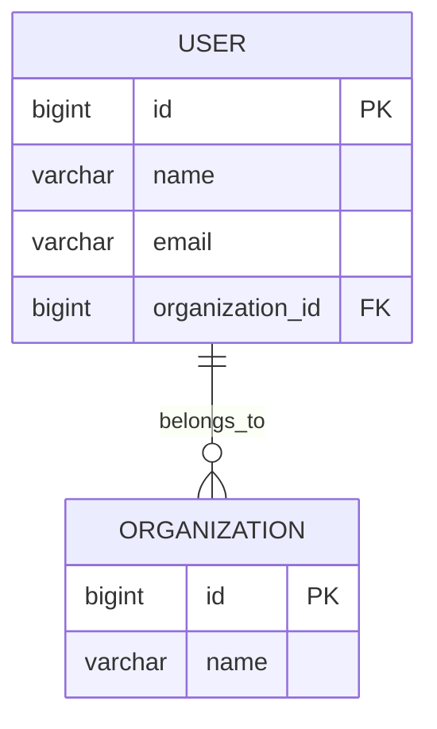

# DB Schema Skill

이 스킬로 `docs/db-schema.md`를 생성하거나 갱신한다.

## 0. 트리거 조건

다음 상황에서 이 스킬을 실행한다.

1. 사용자가 DB 스키마/ERD/DDL 생성을 명시적으로 요청한다.
2. 새로운 `@Entity` 클래스가 생성되거나 기존 Entity의 필드/관계가 변경된다.
3. Flyway 마이그레이션 파일이 추가된다.

## 1. Entity 탐색

1. 프로젝트 내 모든 `@Entity` 클래스를 탐색한다.
2. 각 Entity에서 다음을 추출한다.
   - 테이블명 (`@Table(name = ...)` 또는 클래스명 기반 추론)
   - 컬럼 목록 (필드명, 타입, nullable, 기본값, 제약조건)
   - PK (`@Id`, `@GeneratedValue`)
   - 관계 (`@ManyToOne`, `@OneToMany`, `@OneToOne`, `@ManyToMany`)
   - 인덱스 (`@Table(indexes = ...)`)
   - Enum 타입 (`@Enumerated`)

## 2. docs/db-schema.md 작성

`docs/db-schema.md`가 없으면 새로 생성하고, 있으면 전체를 갱신한다.

### 문서 구조

```markdown
# DB Schema

## DB ERD



## DB 테이블 설명

### user

| 컬럼 | 타입 | NULL | 기본값 | 설명 |
|------|------|------|--------|------|
| id | bigint | NO | auto | PK |
| name | varchar(255) | NO | - | 사용자명 |
| email | varchar(255) | NO | - | 이메일 |
| organization_id | bigint | YES | NULL | FK → organization.id |

## DDL CREATE 문

```sql
CREATE TABLE "user" (
    id BIGSERIAL PRIMARY KEY,
    name VARCHAR(255) NOT NULL,
    email VARCHAR(255) NOT NULL,
    organization_id BIGINT REFERENCES organization(id)
);
```
```

## 3. ERD 작성 규칙 (Mermaid erDiagram)

1. 테이블명은 대문자 스네이크 케이스로 작성한다.
2. 컬럼에 PK, FK를 명시한다.
3. 관계선은 Entity의 JPA 어노테이션에서 파생한다.
   - `@ManyToOne` → `||--o{`
   - `@OneToMany` → `}o--||`
   - `@OneToOne` → `||--||`
   - `@ManyToMany` → `}o--o{`
4. 관계 라벨은 필드명 또는 의미를 간결히 작성한다.

## 4. 테이블 설명 작성 규칙

1. 테이블별로 `### 테이블명` 소제목을 만든다.
2. 표에 컬럼, 타입, NULL 여부, 기본값, 설명을 포함한다.
3. FK 컬럼은 설명에 `FK → 참조테이블.컬럼`을 명시한다.
4. Enum 컬럼은 설명에 가능한 값 목록을 명시한다.

## 5. DDL CREATE 문 작성 규칙

1. PostgreSQL 문법을 사용한다.
2. Entity의 JPA 어노테이션과 실제 Flyway 마이그레이션을 참고해 정확한 DDL을 작성한다.
3. Flyway 마이그레이션 파일(`src/main/resources/db/migration`)이 있으면 해당 DDL을 우선 참고한다.
4. 마이그레이션 파일이 없으면 Entity 어노테이션에서 DDL을 추론한다.
5. 테이블별로 분리하여 작성한다.

## 6. 안전 규칙

1. 이 스킬은 `docs/db-schema.md` 파일만 생성/수정한다. Entity 코드나 마이그레이션 파일을 수정하지 않는다.
2. 기존 `docs/db-schema.md`가 있으면 전체를 최신 Entity 기준으로 교체한다.
3. 문서 최상단에 자동 생성 안내를 포함하지 않는다 (깔끔한 문서 유지).